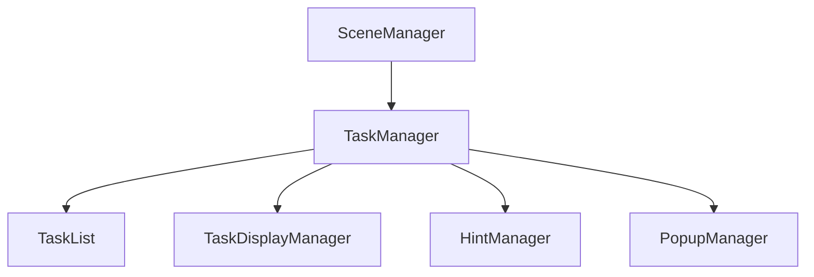
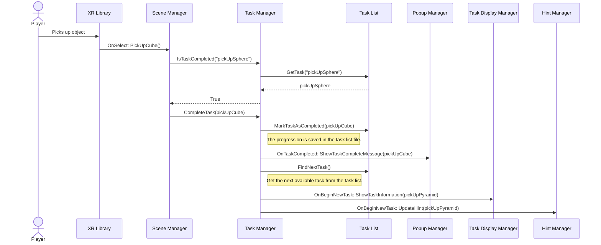
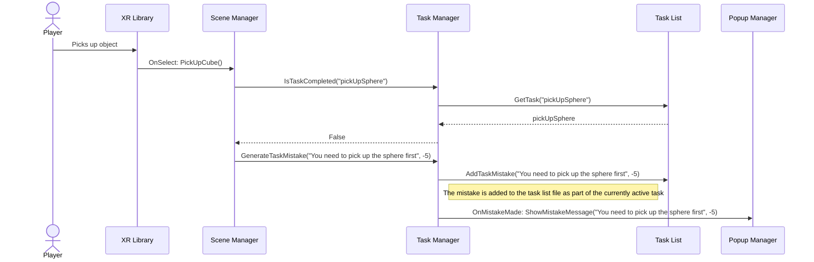

# Architecture
This document describes the basic idea of the architecture used in newer sections of the game. The changing room, medicine preparation and the membrane filtration scenes do not use this architecture. Please refer to [the old architecture image](/Docs/architecture.jpg) for information related to that.

## Structure
The concept for the architecture is the following:

### SceneManager
The scene manager is an independent script that is made for every scene that handles the logic for the scene. This script has public functions that may call the Task Manager functions and these functions may be called, for example, through the XR library's OnSelect events or through separate scripts. But the idea is that the task manager is referenced only through this singular script.

### TaskManager
The task manager is a script that is attached to an empty in the scene that manages the tasks associated with the scene. This should be the only script that communicates with the task list. There are several different events that are invoked and that are suitable for updating different managers.

### TaskList
This is a scriptable object (in other words, a file) that stores tasks, keeps track of completed tasks, stores mistakes and saves the player's score. Since all of this information is stored in a file, the tasks can be tracked across different scenes. However, this means that the tasks have to be manually reset.

### TaskDisplayManager
This is a script that handles all of the displays that show the user's current task.

### HintManager
This is a script that handles all of the hint boxes in the scene.

### PopupManager
This is a script that handles all of the messages and popups shown to the player. For example, this script shows the player messages when he fails a task, completes a task or needs to some sort of a notification.

## Example 1
In this situation, the player first needs to pick up a sphere, a cube and a pyramid in that order. In the start, the player has already picked up the sphere and now picks up the cube.

## Example 2
This is the same situation as in Example 1, but now the player hasn't yet picked up the sphere and tries to pick up the cube.

## Why this architecture?

### Advantages
- Modularity: In the older architecture, all of the references to different classes and managers were hard-coded. For example, if you wanted to have different kinds of hint boxes in different scenes, implementing it would be either very difficult or impossible. Here, however, all of the calls made by Task Manager to other managers are done through events, so it is easy to remove or replace event listeners using the inspector.
- Debugging: Since all of the game events happen in one file (SceneManager), it should be fairly easy to find the correct line of code and to change game events. In the older architecture all of the game events were scattered across the scene so it was fairly difficult to trace problems. The older architecture's event system was also difficult to follow.
- Scriptable Object: Since the tasks are stored in a file instead of being hardcoded into a script, it should be easy to modify the information related to tasks and the tasks used in a script are easy to swap, while also providing a way to track task progression across scenes.
- Testing: Since all of the game events are called through simple function calls in the scene manager, it should be fairly easy to do unit tests on the scene.

### Disadvantages
- Calls to the scene manager script: Implementing the calls in the scene may be tedious. If you want to use the same object in multiple scenes that use different scene managers, there are two ways to do this.
    1. Use Unity events: Here if you need to place the same object in the scene multiple times, then you need to add event listeners to every single object separately.
    2. Use function calls in the script: Here when the player does something with the object, a separate script needs to be implemented which checks which scene manager is currently residing in the scene and then make calls based on that information.