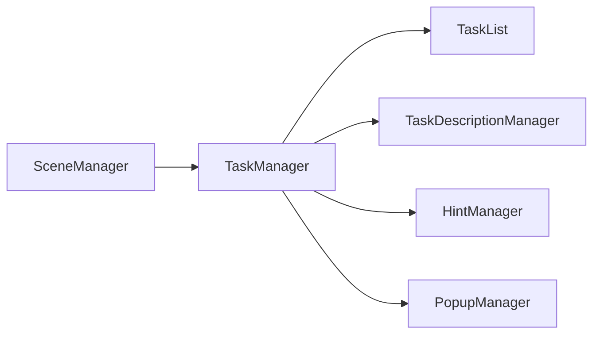
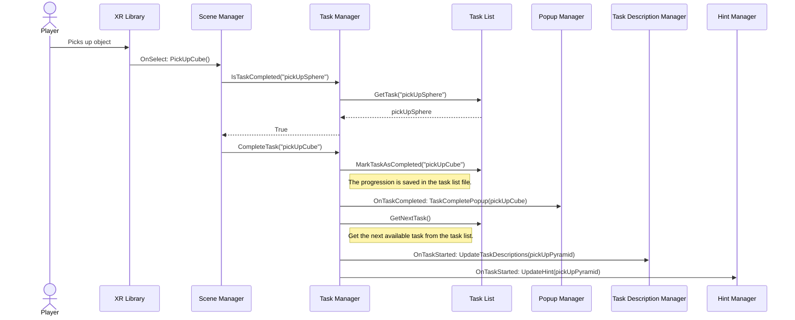
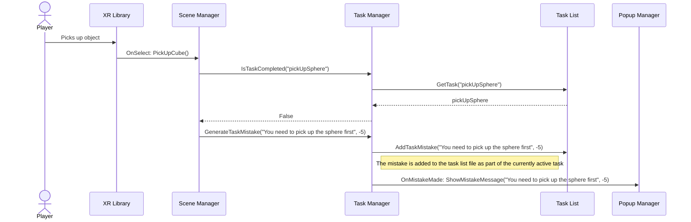

# Architecture
This document describes the basic idea of the architecture used in newer sections of the game. The changing room, medicine preparation and the membrane filtration scenes do not use this architecture. Please refer to [the old architecture image](/Docs/architecture.jpg) for information related to that.

Please note that this document is designed to give a general idea of how the architecture works. Different scenes have different needs, so some modules may be swapped around.

## Structure
The concept for the architecture is the following:

### SceneManager
The scene manager is an independent script that is made for every scene that handles the logic for the scene. This script has public functions that may call the Task Manager functions and these functions may be called, for example, through the XR library's OnSelect events or through separate scripts. The task manager may be called directly from other scripts, but if there is some logic related to certain tasks (i.e items should be grabbed in a specific order to complete a task), then this logic should be handled by this script.

### TaskManager
The task manager is a script that is attached to an empty in the scene that manages the tasks associated with the scene. This should be the only script that communicates with the task list. There are several different events that are invoked and that are suitable for updating different managers.

### TaskList
This is a scriptable object (in other words, a file) that stores tasks, keeps track of completed tasks, stores mistakes and saves the player's score. Since all of this information is stored in a file, the tasks can be tracked across different scenes. However, this means that the tasks have to be manually reset.

### TaskDescriptionManager
This is a script that handles all of the displays that show the user's current task.

### TaskboardManager
This script is made to show the player all the tasks they can do and which tasks they have completed. 

### HintManager
This is a script that handles all of the hint boxes in the scene.

### PopupManager
This is a script that handles all of the messages and popups shown to the player. For example, this script shows the player messages when he fails a task, completes a task or needs to some sort of a notification.

## Example 1
In this situation, the player first needs to pick up a sphere, a cube and a pyramid in that order. In the start, the player has already picked up the sphere and now picks up the cube.

## Example 2
This is the same situation as in Example 1, but now the player hasn't yet picked up the sphere and tries to pick up the cube.

## Why this architecture?

### Advantages
- Modularity: In the older architecture, all of the references to different classes and managers were hard-coded. For example, if you wanted to have different kinds of hint boxes in different scenes, implementing it would be either very difficult or impossible. Here, however, all of the calls made by Task Manager to other managers are done through events, so it is easy to remove or replace event listeners using the inspector.
- Debugging: Since all of the game events happen in one file (SceneManager), it should be fairly easy to find the correct line of code and to change game events. In the older architecture all of the game events were scattered across the scene so it was fairly difficult to trace problems. The older architecture's event system was also difficult to follow.
- Scriptable Object: Since the tasks are stored in a file instead of being hardcoded into a script, it should be easy to modify the information related to tasks and the tasks used in a script are easy to swap, while also providing a way to track task progression across scenes.
- Testing: Since all of the game events are called through simple function calls in the scene manager, it should be fairly easy to do unit tests on the scene.

### Disadvantages
- Calls to the scene manager script: Implementing the calls in the scene may be tedious. If you want to use the same object in multiple scenes that use different scene managers, there are two ways to do this.
    1. Use Unity events: Here if you need to place the same object in the scene multiple times, then you need to add event listeners to every single object separately.
    2. Use function calls in the script: Here when the player does something with the object, a separate script needs to be implemented which checks which scene manager is currently residing in the scene and then make calls based on that information.

## Multiple task managers

It is also possible to use multiple task managers in one Unity scene. In this case you need to make sure that you manually set the correct items to all the other managers (for example, you need to manually set the hint boxes to the hint box manager).

### Example case of multiple task managers

Let's imagine a scene where the user can go to two different rooms, each with its own set of tasks. Let's say the user has to assemble a pump in room A and the user has to extinguish a fire in room B. In this case the scene needs three different task managers: task manager for assembling the pump, task manager for extinguishing the fire and a master task manager for tracking the task lists in the rooms.

An example of the task lists:

### Room A (Assemble pump)
> - Grab the filter and open it from its package
> - Attach the filter to the pump
> - Turn on the pump

### Room B(Extinguish fire)
> - Grab the fire extinguisher
> - Remove the safety pin
> - Extinguish the fire

### Master
> - Assemble the pump
> - Extinguish the fire in Room B

Now when the user completes all the tasks in Room A, the task manager then sends a message to the master task manager through the OnAllTasksCompleted event that the "Assemble the pump" task has been completed. 

When all the tasks in both rooms have been completed, the master task manager's OnAllTasksCompleted event is invoked and a door can be unlocked, for example.

This would not function with a single task manager and a single task list as then it wouldn't be possible to show the different tasks that the rooms have since only one task can be active at one time. The user can also now freely choose which room he wants to go to first.

It may also be beneficial to adding different functionality to the different task lists. For example, there could be different sounds when completing a task in a room and completing a master task.

**Note that this is only an example. A master task list may not even be necessary. This is just an example, use your own judgement.**

### Multiple task managers in the tutorial

The only scene in which multiple task managers is currently used is the [controls tutorial](/Assets/_Scenes/ControlsTutorial.unity). In the scene there is a master task manager and a separate task manager for the pump tutorial section. 

This solution was selected as this provides the most flexibility with modifying the tutorials if need be. The master task manager changes the scene when a task is completed in the master task list. The pump section, however, needed to have extra tasks to guide the player to complete the tutorial section. There was also a need to show the player hints relating to the pump tutorial's tasks. This couldn't be done with a singular task list as then the tutorial section transitions would have to be done manually. This would have caused a lot of headache if a tutorial section needs to be modified, as then the developer would also have to make sure that the transition is called in the right place.

Now the pump tutorial section sends a message to the master task list when all of the pump tutorial's tasks are completed and the tutorial section transition is invoked. Additionally, now it is possible for the pump tutorial section to not feature popups when completing a pump tutorial task. If steps need to be added to the pump tutorial, then you only need to add steps to the pump tutorial's task list and make sure that they are set as completed, the transitions should still work smoothly.

If you want to see how multiple task managers were used in the tutorial, open the [ControlsTutorial scene](/Assets/_Scenes/ControlsTutorial.unity) in Unity. The master task list is attached to the `GameManager` object and the pump tutorial's task manager is attached to the `TutorialScenes/PumpTutorial/PumpTutorialManager` object.

### Using the new architecture may not be intuitive so we have prepared a checklist for creating a new task

The new architecture requires your scene to hold a game object containing a sceneManager, and a taskManager. A task list object should be created, and attached to the taskManager's taskList variable.

Link your taskManager to your sceneManager in the inspector.

Adding tasks is easy; simply press the plus(+) button on the taskList object you have chosen, and enter the task's information.

After this you should add the the functionality of the task into the sceneManager.

Completing the task happens throug the taskManager, so creating a specific function in the sceneManager to do this is recommended for cleaner code.

The task completion is called with the name defined for the function in the taskList, so check that the names match.

### What team 7 learned about the new architecture:

It is not a good plan to place all task handling into the scene managers. The scene manager can easily stretch out to be very long, and difficult to read.  
Writing a dedicated script for handling task functionality would be useful in the new architecture as well.