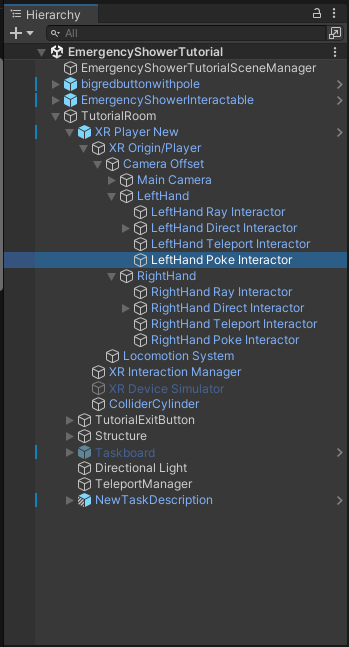
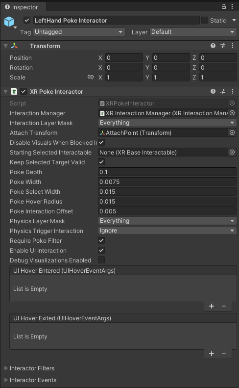
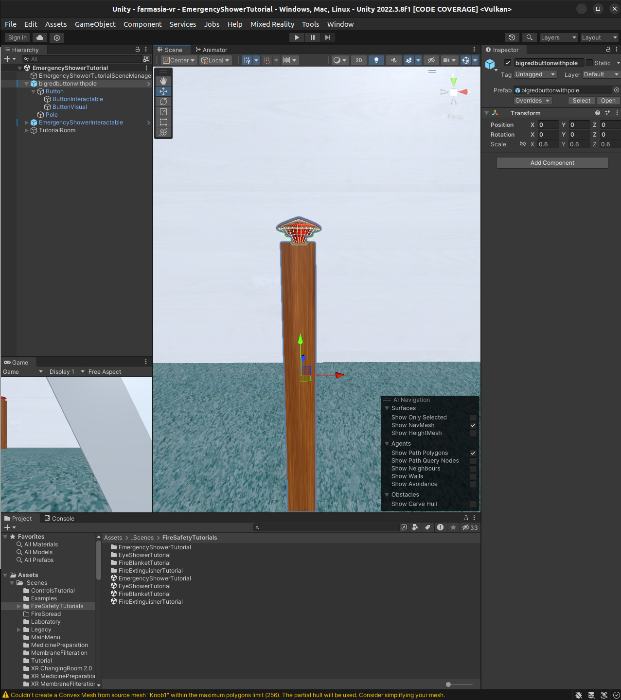
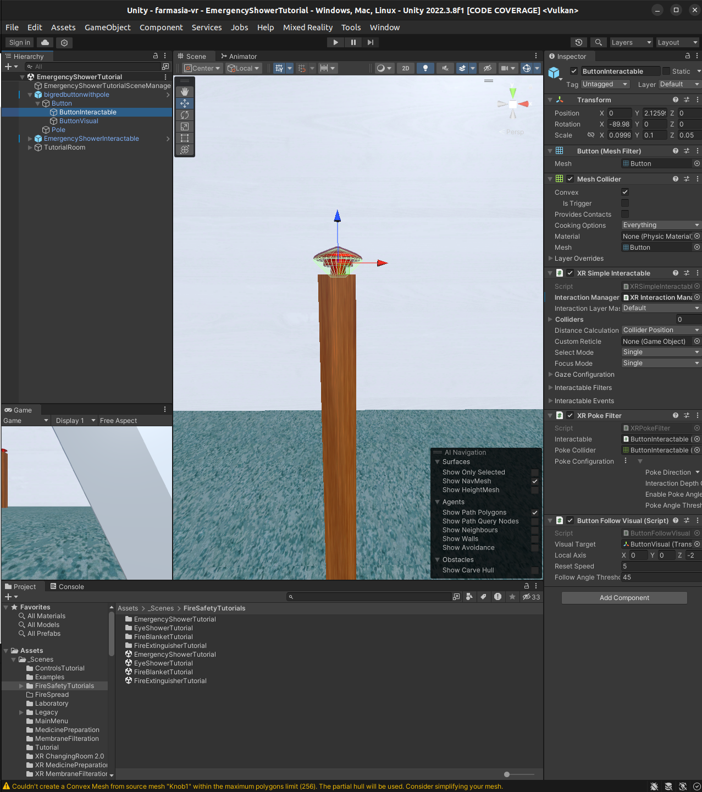
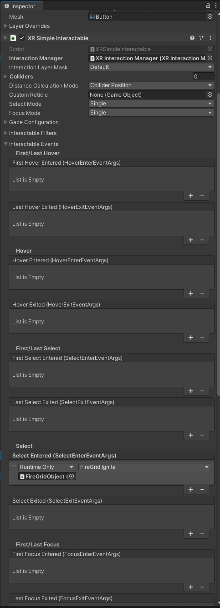
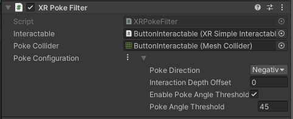
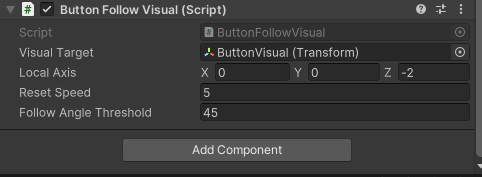

# Poke Interactor

The PokeInteractor used in the project is part of the Unity Engine's own [XR Interaction Toolkit](https://docs.unity3d.com/Packages/com.unity.xr.interaction.toolkit@2.3/manual/index.html). It is used, as the name suggests, for interactions and, through those interactions, to track and fire events that might be a part of the tasks of the game. 
Further reading on Unity's documentation page: [XR Poke Interactor](https://docs.unity3d.com/Packages/com.unity.xr.interaction.toolkit@2.3/manual/xr-poke-interactor.html).

## XR Poke Interactor as a part of the XR Player

The best way to use the `XR Poke Interactor` is by setting it as a child of the corresponding hand that you want interaction with. 

In the `EmergencyShowerTutorial` the `Poke Interactor` for the left hand object, defined as `LeftHand`, is set as `LeftHand Poke Interactor` and for the right hand object, defined as `RightHand`, is set as `RightHand Poke Interactor`. 

### LeftHand Poke Interactor

The `LeftHand Poke Interactor` contains the `Transform` and the Unity native `XR Poke Interactor` script as components. `Transform` defines the location of this child object, so we don't have to think about it.

The `XR Poke Interactor` script contains references to the ``XR Interaction Manager``: a Unity native script and a manager that manages different interactors within the game as an intermediary. More about [XR Interaction Manager](https://docs.unity3d.com/Packages/com.unity.xr.interaction.toolkit@2.5/manual/xr-interaction-manager.html) in Unity documentation. 

The ``Interaction Layer Mask`` defines the layer of interactors and interactables that can be used. This means that you can include or exclude different interactors or interactables within a layer without causing overlap. 

The ``Attach Transform`` is an important part of the poke interactor as it defines the location where the poke is calculated and checked from. In our example case the ``Attach Point`` of the ``Attach Transform`` has been placed at the palm of the hand. The point in this part of the game is to be able to slam the big red button with your hand. 
You can find the ``Attach Point`` by clicking on the object reference in the ``Attach Transform`` or by searching and finding it as a child under the ``LeftHand Direct Interactor``. Note that the ``AttachPoint`` had to be placed there in order to work due to Unity's internal logic.
It is possible to create multiple Poke Interactors as we've done in the `XR Membrane Filteration 2.0` scene. In that scene the interactors are used to take fingerprints and the attach points are placed in both hands' middlefingers and thumbs.

## Example of use in the project

Let's look at the `bigredbuttonwithpole` game object in the scene `EmergencyShowerTutorial` as a working example.

The object is divided in to two children from the root prefab: `Button` and `Pole`. Pole is basically a mesh with texturing so we can ignore it. 

`Button` has two children `ButtonInteractable` and `ButtonVisual`. `ButtonVisual` is, as the name suggests, only the visual part of the button containing the mesh and the texturing.

### ButtonInteractable

In the `ButtonInteractable` we can see the components consist of the objects `Transform`, `Mesh Filter`, `XR Simple Interactable`, `XR Poke Filter` and a script called `Button Follow Visual`.

`Transform` defines the location of the child object while `Mesh Filter` draws the object shape. The `Mesh Collider` is the collider physics component of the object. 

#### XR Simple Interactable

What we're interested in is the `XR Simple Interactable` script. The `XR Simple Interactable` is a part of the Unity native `XR Interaction Toolkit` and provides logic for an interactable object. 

Here we can see that when an interactor object selects or in this case enters the button's collider the `Ignite()` method/function of the `FireGrid` script is called. These `InteractableEvents` are an extremely useful and absolutely a recommended way of doing method/function calls for interactable events meaning any game event or game logic you want to trigger from an interactable object.
By clicking the `FireGridObject` reference under the drawer that says `Runtime Only`, Unity editor automatically highlights the referenced object in the `Hierarchy` window. 
Further reading can be found in the Unity documentation on [Interactable Events](https://docs.unity3d.com/Packages/com.unity.xr.interaction.toolkit@2.3/manual/extending-xri.html).

#### XR Poke Filter

The next component in the object is the `XR Poke Filter` which is a Unity native script. 

The filter has a reference to the `ButtonInteractable`'s own aforementioned `XR Simple Interactable`. Then it has a reference to the aforementioned `Mesh Collider` of the object. ``Poke Direction`` determines the axis on which the interaction will be constrained to and ``Interaction Depth Offset`` determines the distance along the interaction axis triggering the poke event sooner or later. ``Enable Poke Angle Threshold`` enables the setting and checking of the ``Poke Angle Threshold`` which is the maximum allowed value in degrees for the poke direction axis. This means that Unity checks for poke interactions coming from the ``Poke Direction`` to the ``Poke Angle Threshold``.

Further reading can be found in the Unity documentation on [Poke Filters](https://docs.unity3d.com/Packages/com.unity.xr.interaction.toolkit@2.3/manual/xr-poke-filter.html).

#### Button Follow Visual

`Button Follow Visual` is a custom script made based on the [<b>Pushable Button with Unity XR Interaction</b>](https://www.youtube.com/watch?v=bts8VkDP_vU) by <b>Valem Tutorials</b> on YouTube. 

It contains the logic for the movement of the button when it's pressed or unpressed. Check the video for more information.
