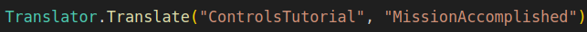

# How to use translations in legacy code (Translator.Translate)

We recommend avoiding this method in upcoming scenes, but sometimes it might be necessary to use. If possible, use [localization](https://github.com/FarmasiaVR/farmasia-vr/blob/dev/Docs/localization.md) instead. 

The code for this legacy localization method can be found here: [Translator](https://github.com/FarmasiaVR/farmasia-vr/blob/dev/Assets/Scripts/Translator.cs).

Basically the Translator.Translate method retrieves text from the localization tables which you have created.

Localization tables can be used like this: Navigate within the project to Assets - Localization - Tables, and either create a new table or make new entries into an existing table. The tables contain translations for the texts used by the `Translator.Translate` method, with the key values listed in the leftmost column.

Here is an example of how it should be used:

In the example, the first column contains the text **"ControlsTutorial"**, which refers to a localization table called `ControlsTutorial`. The second column contains the text **"MissionAccomplished"**, which means that in the localization table (called `ControlsTutorial`), should be an entry with the key `MissionAccomplished`.

This means that the `Translator.Translate` method retrieves the translated text associated with the key `MissionAccomplished` from the localization table `ControlsTutorial` and returns the translated text in **string** form.

Some practical examples of the use of `Translator.Translate` can be found from in the following files: [PopupManager](https://github.com/FarmasiaVR/farmasia-vr/blob/dev/Assets/Scripts/Managers/PopupManager.cs), [HintBoxNew](https://github.com/FarmasiaVR/farmasia-vr/blob/dev/Assets/Scripts/Utilities/HintBoxNew.cs), [TaskDescriptionManager](https://github.com/FarmasiaVR/farmasia-vr/blob/dev/Assets/Scripts/Managers/TaskDescriptionManager.cs).
