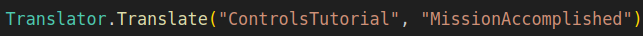

# How to use translations in legacy code (Translator.Translate)

We recommend you to avoid this method in the upcoming scenes but sometimes this might be neccessary. If possible, use [localization](https://github.com/FarmasiaVR/farmasia-vr/blob/dev/Docs/localization.md) instead. The code for this legacy localization method is found here: [Translator.cs](https://github.com/FarmasiaVR/farmasia-vr/blob/dev/Assets/Scripts/Translator.cs).

Here is an example of how it should be used:

