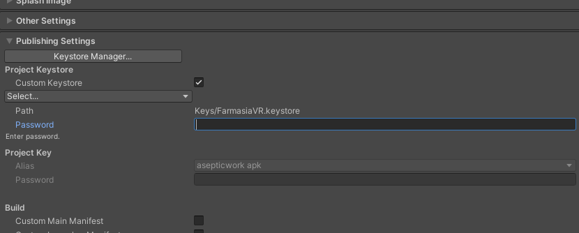

# How to make a release on AppLab
This document details how to make a new release on Meta's AppLab. Note that this only covers uploading the APK to a pre-release branch and the process for releasing an update on the production branch may be slightly different.

## Making a signed APK build
Whenever you want to make an APK build of the game, you need to enter the key password in Unity in order to sign the APK. The passwords should be provided to you outside of this repository.

1. In Unity, select File -> Build Settings -> Player Settings -> Android tab -> Publishing Settings.
2. Enter the keystore password.
3. Enter the project key password.
4. Build the Unity Android player.

## Releasing the build on Meta AppLab
There are two ways to release a build on AppLab. One way is by using Meta Quest Developer Hub (later referred to as MQDH), which has a graphical user interface, or by using Oculus Platform Utility, which is a command-line interface.

### Making a release using the Meta Quest Developer Hub
1. Install [Meta Quest Developer Hub](https://developer.oculus.com/meta-quest-developer-hub)
2. Log in using the credentials that are added to the FarmasiaVR organization.
3. From the left tab select *App Distribution*.
4. Select *Aseptic Work - FarmasiaVR*
5. Select *Upload* on the channel that you want to make the release on.
6. Select or drag the APK you want to upload and click *Next*.
7. Write the release notes if you want to. This is recommended so that the users have an idea of what's changed.
8. Select *Next* and select *Upload*.
Now the APK is being uploaded and tested. After the tests have passed, the update should be immediately available.

MQDH does however have a fun quirk where sometimes it will fail to upload and it won't even tell you why :confused:. In this scenario the only option is to use the Oculus Platform Utility.

### Making a release using Oculus Platform Utility
1. Download the [Oculus Platform Utility](https://developer.oculus.com/resources/publish-reference-platform-command-line-utility/) to a directory of your choice.
2. Go to the directory using the terminal and enter the command 
```bash
ovr-platform-util upload-quest-build --app_id <ID>  --app_secret <App-Secret> --apk <path/to/Your.apk> --channel <ReleaseChannel> --notes <ReleaseNotes>
```
where
- ID: Obtained from the API tab in your app's page in the Oculus Developer Center
- App Secret: Also obtained from the API tab in your app's page.
- Channel: Is the channel where you want to release the build. The list of channels can be seen in MQDH or on the app's page under *Distribution* and *Release Channels*. e.g `--channel rc`
- Release Notes: A summary of what has changed. This will be seen by the user. This is not mandatory, but recommended. Write all of the changes in one string and make the returns using \n.
