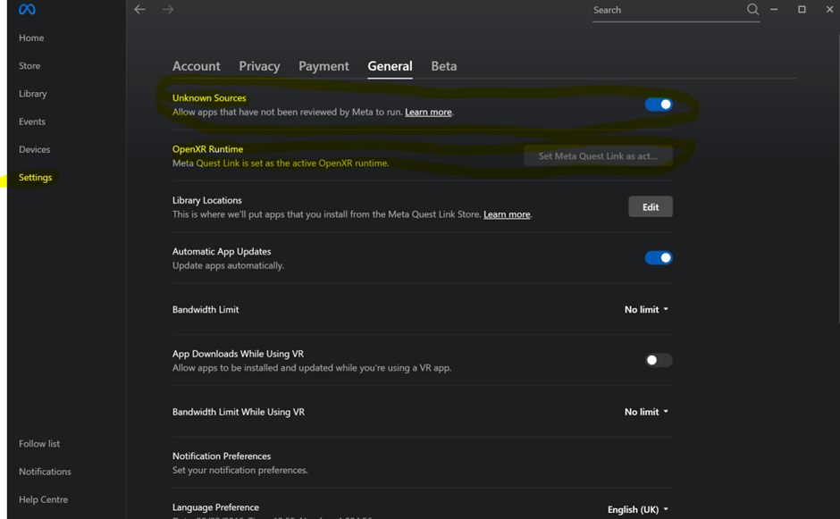
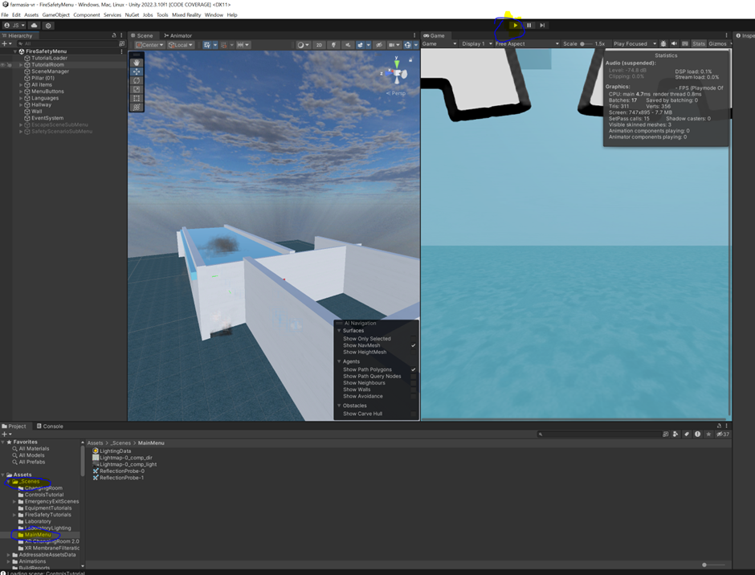
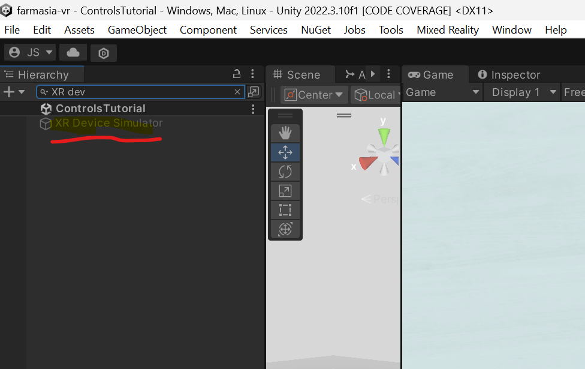

"It works on my machine" ohjeet Meta Quest 2 käyttöön omalla koneella. Lataa Meta Quest Link ohjelmisto ja yhdistä headsetti kaapelilla USB3, USB-C tai Thunderbolt 3 tai 4 porttiin.
Tee laitemääritys headsetille Link (Cable) kautta. Sen jälkeen mene Settings ja klikkaa Set Meta Quest Link as active OpenXR runtime ja klikkaa hyväksyntä Unknown sources käytölle. 
Sitten aukaise FarmasiaVR projekti Unity Hubissa ja klikkaa kuvan mukaisesti Assets -> Scenes -> Main menu ja sitten play näppäintä yläriviltä. Laita headset päähän ja jos kaikki on mennyt kuin eräässä kokkiohjelmassa näet pelin. 
Voi myös olla että peli ei vielä näy vaan näet valikon kun katsot hieman alaspäin. Tästä valikosta sinun tulee valita Unity ruudulla näytettäväksi. (huom käytössä siis Windows pöytäkone, Linux kokemus voi olla jotain täysin muuta)

Pelin testaus ilman VR laseja! Alla olevan kuvan mukaisesti etsi hierarkiasta XR device simulator, klikkaa sitä ja togglaa inspectorista XR device simulator päälle. Sitten vain painat play ja peliä voi pelata ilman laseja.

