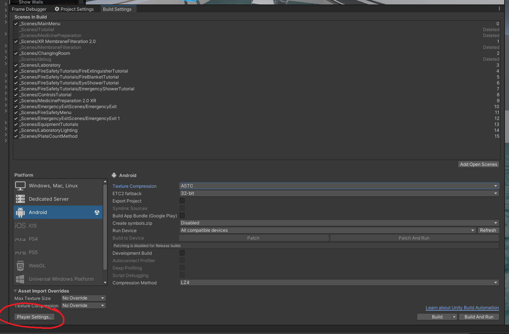
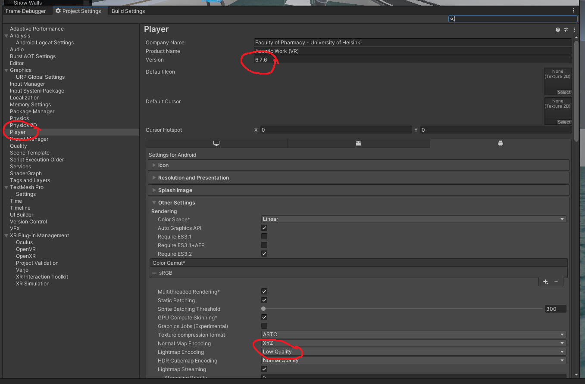
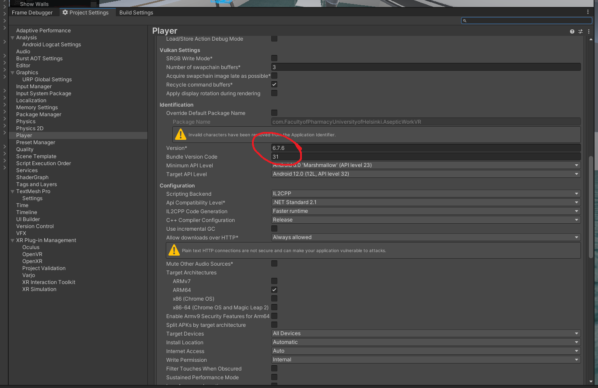
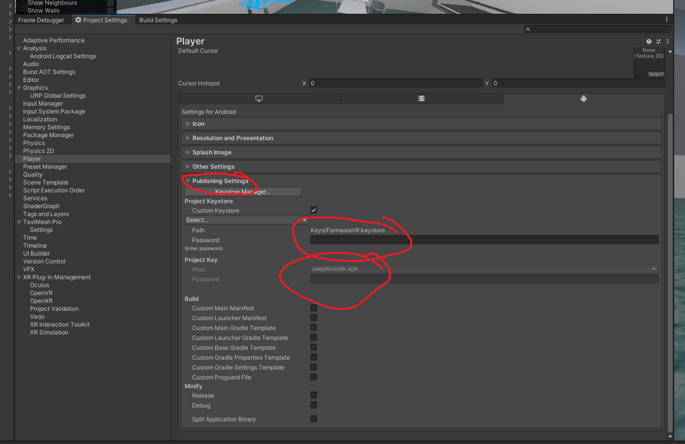
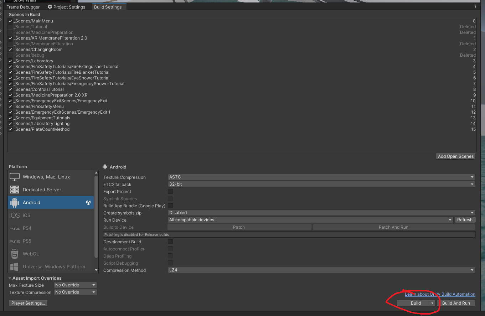
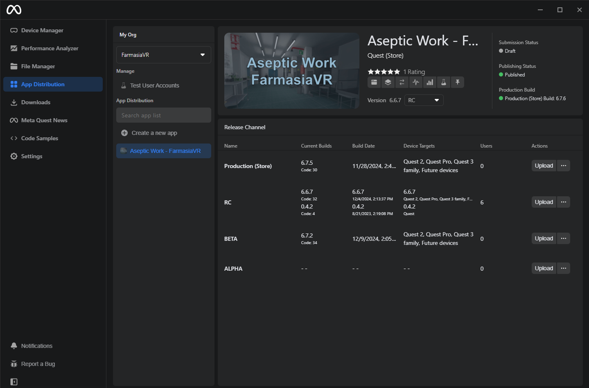
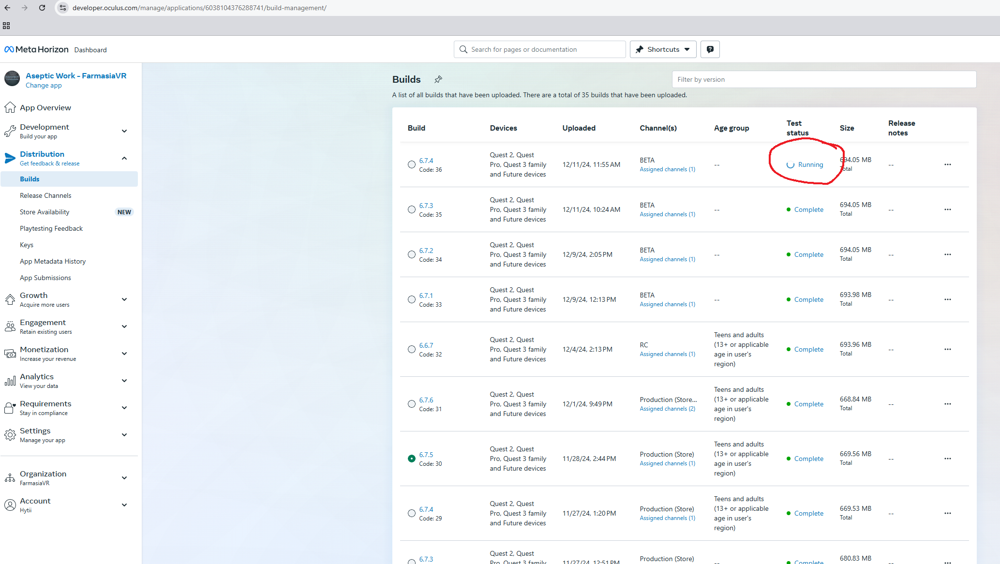

# Making and releasing a build to Meta Store

## Unity

`File -> Build Settings`\
`Set Platform to Android`\
`Go to Player Settings`

There are a **lot** of options in the project settings that affect the quality of the build.

In `Player Settings` Set the Version of your build.\
We decided to use a version naming convention where the first number is the Group (of cs students assigned to the project), second number is the Sprint and the third number is just a counter for that sprint's builds.

The lightmap encoding option sets all baked lightmaps to a quality level. The quality is set to high, but this needs option `Split Application Binaries` checked because **there is a 1.1GB file size limitation** when uploading an .apk to the Meta Store. This option generates an .obb file alongside the .apk which will be uploaded together with the .apk.

Further down on the `Player Settings -> Other Settings` submenu there is a Version number field and below that is the `Bundle Version Code`. This bundle version code **needs to be incremented** every time you publish a build or the Meta Quest Developer Hub won't accept the build.

In `Player Settings -> Publishing Settings` you need to fill in the keystore password and the project key. These keys are stored outside of this repo, ask your project advisor for these.

**Before you build make sure you have toggled off the `Device Simulator` from all the scenes** 

After all the settings are set. `Build Settings -> Build` the first build you make on a computer might take a *while*.

After building you have two options for uploading the build to the Meta Store, either the Meta Quest Developer Hub, or the [`ovr-platform-util` command-line tool](https://developers.meta.com/horizon/resources/publish-reference-platform-command-line-utility/).

## Meta Quest Developer Hub

### Making a release using the Meta Quest Developer Hub
1. Install [Meta Quest Developer Hub](https://developer.oculus.com/meta-quest-developer-hub)
2. Log in using the credentials that are added to the FarmasiaVR organization.
3. From the left tab select *App Distribution*.
4. Select *Aseptic Work - FarmasiaVR*
5. Select *Upload* on the channel that you want to make the release on.
6. Select or drag the APK you want to upload and click *Next*.
7. Write the release notes if you want to. This is recommended so that the users have an idea of what's changed.
8. Select *Next* and select *Upload*.
Now the APK is being uploaded and tested. After the tests have passed, the update should be immediately available.

After the tests are completed you can download/update the new build to the Quest 2 headset from the store/app library.\
Depending on the channel you chose to publish on you might have to change the channel in the headset's library where the app is located.

## `ovr-platform-util`

1. Install the tool from [here](https://developers.meta.com/horizon/resources/publish-reference-platform-command-line-utility/)
2. Get the App ID and App Secret from the [Meta Quest Developer Dashboard](https://developers.meta.com/horizon/manage/), under Development -> API
3. Rename the OBB file to follow the format `main.[build number].com.FacultyofPharmacyUniversityofHelsinki.AsepticWorkVR.obb`
4. In the directory containing the build .apk and .obb files, execute the command `ovr-platform-util upload-quest-build -a [APP ID] -s [APP SECRET] --apk AsepticWorkVR.[VERSION].apk --obb main.[BUILD NUMBER].com.FacultyofPharmacyUniversityofHelsinki.AsepticWorkVR.obb -c [RELEASE CHANNEL] --age-group TEENS_AND_ADULTS`