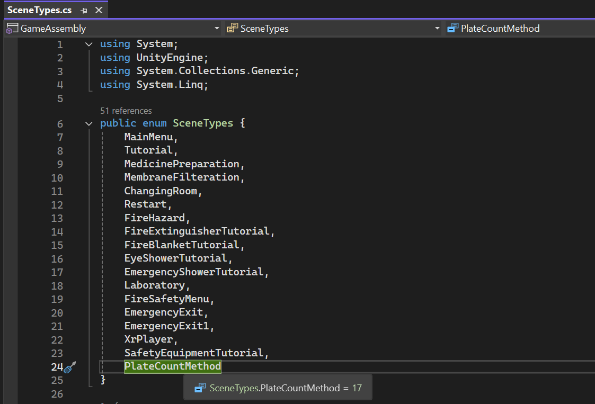
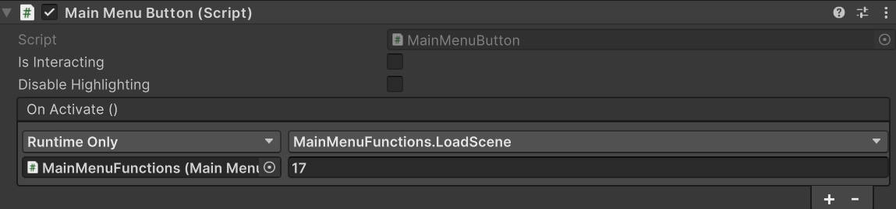

# How to connect a new Unity scene to the Main menu buttons

After creating a new Unity scene you must add it to the Build settings of the project. 
File -> Build Settings (You can just drag and drop the scene to the Scenes in Build box)

To connect to this scene from the main menu you need to add the scene name to:
Assets -> Scripts -> MainMenu -> SceneTypes
In the SceneTypes script you need to add the exact scene name into the SceneTypes enum and also to the dictionary sceneTypeToName. Keep in mind that the placement of the scene name in the enum determines the number to which you need to reference in Main Menu to get to the scene. In the below picture to get from main menu to scene "PlateCountMethod" you would need to reference scene number 17.

After making the changes to the SceneTypes script you can connect to the scene from the main menu by simply duplicating an existing button and changing where the MainMenuFunctions.LoadScene method points to in the buttons Main Menu Button script component and in the buttons XR simple interactable components Interactable events -> Select Entered Event Args. 

