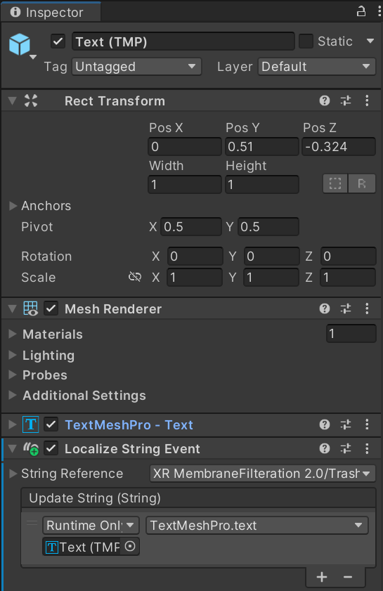

# How to localize scenes 

To create translations for texts in scenes (a.k.a localize them) you first need to add the LocalizationManager prefab asset to the scene hierarchy. Then add the component Localize String Event to the desired text (Text Mesh Pro) item.

Then you need to click the plus sign on the Update String box within the Localize String Event component and drag and drop the same text item from the hierarchy to the Update String box row where it reads "None (Object)" (in the picture above the text item is already dragged in). Then you need to select the item inside the Update String box where it reads No Function and select TextMeshPro -> Text.

Next you should navigate within the project to Assets - Localization - Tables, and either create a new table or make new entries into an existing table. Within the tables are translations for the texts accessed by Localize String Event with the Key value on the left most column. After adding a key and the translated texts you should go back to the text item you wish to be able to localize and add the TableName/Key to the Localize String Event string reference as in the above picture. Then you are set!  