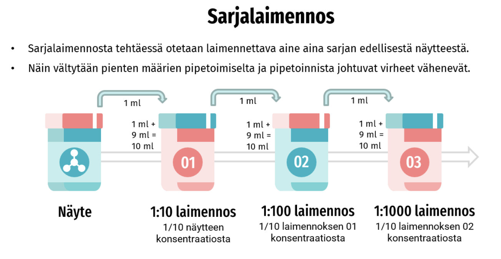

# Sennanlehden mikrogiologisen puhtauden määritys maljalaskenta-menetelmällä

## Työssä tarvitaan:

-  sabouraud-dekstroosiagarmaljat 4 kpl (kaksi punaista viivaa maljalla)
-  kaseiini-soija-agarmaljat 4 kpl (punainen ja keltainen viiva maljalla)
-  fosfaattipuskuria
-  1 ml tai 2 ml ja 5 ml steriilejä kertakäyttöisiä mittapipettejä
-  pipettori
-  automaattipipetti ja steriilit pipetinkärjet
-  levityssauvat 4 kpl
-  sennanlehteä
-  steriilit koeputket ja koeputkiteline

## Työn suoritus:
1. Punnitse opetuslaboratoriossa ennen aseptiseen tilaan menoa 100 mg sennanjauhetta steriiliin koeputkeen. Tämä tulisi tehdä hyvissä ajoin, esimerkiksi edellisenä päivänä. Seuraavat työvaiheet 2-6 suoritetaan aseptisessa tilassa.
2. Pipetoi fosfaattipuskuria koeputkiin: 5 ml (1 kpl); 4,5 ml (3 kpl) ja 1 ml (1 kpl).
3. Suspensoi 100 mg rohdosnäytettä 5 ml:aan fosfaattipuskuria. 
4. Tee rohdossuspensiosta 1:10 laimennos 4,5 ml:aan fosfaattipuskuria ja siitä edelleen kaksi sarjalaimennosta (1:100 ja 1:1000) seuraaviin fosfaattipuskuriputkiin. Huom! Laske ennen aseptiseen tilaan menoa, miten sarjalaimennos tehdään (oikea vastaus: 0.5 ml siirretään yhdestä koeputkesta toiseen). 
5. Näytettä levitetään agarin pinnalle automaattipipetin avulla 0,1 ml/malja levityssauvan avulla. Negatiivisesta kontrollista (pelkkä fosfaattipuskuri) tehdään yksi malja kummallekin alustalle. Sekä TAMC- että TYMC-määritykseen käytetään siis 4 maljaa kumpaankin. 
6. Inkuboi TAMC-maljoja 37 °C:ssa 3-5 vrk ja TYMC-maljoja 25 °C:ssa 5-7 vrk.
7. Tulokset lasketaan yhdeltä TAMC ja yhdeltä TYMC maljalta, jossa kasvaa sopiva määrä pesäkkeitä (CFU = Colony Forming Unit) tai jossa pesäkkeet ovat laskettavissa. Laske lopulliset tulokset yksikössä CFU/g rohdosta. Tulosten laskemisesta on Moodlessa video: Mikrobipitoisuuden määrittäminen (lasku). 

